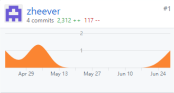
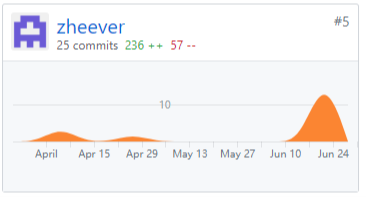
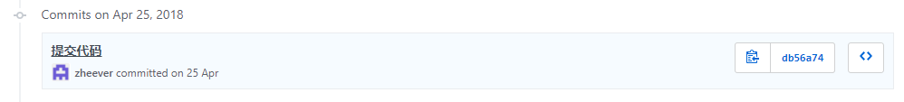
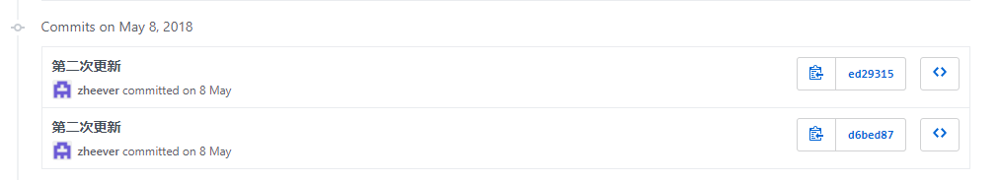
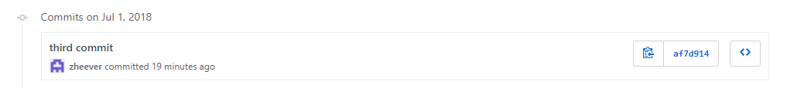

# author: zhe 15331126  github: zheever

| PSP 2.1 | Personal Software Process Stages | Time/h |
| - | - | - |
| **Planning** | **计划** | **7** |
| -　Estimate | -估计这个任务需要多少时间  | 7 |
| **Development** | **开发** | **69** |
| -　Analysis | -需求分析（包括学习新技术） | 20 |
| -　Design Spec | -生成设计文档 | 15 |
| -　Design Review | -设计复审（和同事审核设计文档） | 3 |
| -　Coding Standard | -代码规范（为目前的开发制定合适的规范） | 4 |
| -　Design | -具体设计 | 12 |
| -　Coding| -具体编码 | 10 |
| -　Code Review | -代码复审 | 0 |
| -　Test | 测试（自我测试，修改代码，提交修改） | 5 |
| **Report** | **报告** | **4** |
| -　Test Report | 测试报告 | 0 |
| -　Size Measurement| 计算工作量 | 0 |
| -　Postmortem & Process Improvement Plan| -事后总结，并提出过程改进计划| 4 |

## 个人Git统计报告

