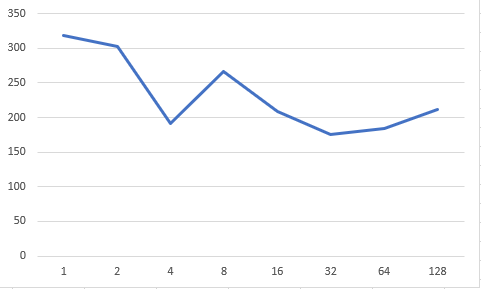

# 数据挖掘实验报告
黄哲 15331126

## Python 多进程

### 1.选择计算方法
选择批量梯度上升法是因为每次迭代整个训练集都要计算梯度，但又互不影响，没有依赖关系和数据访问冲突问题。最终参数的更新在全部样本完成梯度计算之后进行汇合。

### 2.查看cpu信息
首先，要清楚所使用机器和并行化相关的配置，如在windows命令行界面输入wmic进入命令行系统管理执行脚本界面，cpu get * 查询cpu信息。


```bash
C:\Users\哲>wmic
wmic:root\cli>cpu get *
AddressWidth：64
Architecture：9
NumberOfCores：2 #双核cpu
NumberOfLogicalProccessors：#四线程（超线程）
name：Inter(R) Core(TM) i5-5200U CPU @ 2.20GHz
Description：Intel64 Family 6 Model 61 Stepping 4
...
```
### 3.多进程
选择多进程而非多线程和Python并行化机制有关。有一个较为普遍的认识：
>python中的多线程其实并不是真正的多线程，如果想要充分地使用多核CPU的资源，在python中大部分情况需要使用多进程。（Python多进程编程）

由于本例中逻辑回归使用Python编程，且所使用的服务器十分符合多核CPU，Python还提供了好用的多进程包multiprocessing，本例采用Python多进程来对逻辑回归的批量梯度上升法进行并行化。
进一步参考为什么在Python里推荐使用多进程而不是多线程？，在Python多线程下，每个线程的执行方式是
1). 获取GIL(Global Interpreter Lock全局解释器锁)
2). 执行代码直到sleep或者是python虚拟机将其挂起。
3). 释放GIL

也就是说，进入CPU执行代码需要获得GIL，而在一个Python进程中，GIL只有一个，即使一个进程中有多线程也只有获得GIL的线程才能执行。非但如此，在释放GIL时的线程锁竞争、切换线程的会消耗资源。
而多进程的好处在于，每个进程有各自独立的GIL，互不干扰，利于并行执行，所以在python中，多进程的执行效率优于多线程(仅仅针对多核CPU而言)。

### 4.实现多进程
#### 使用multiprocessing
>python中的多线程其实并不是真正的多线程，如果想要充分地使用多核CPU的资源，在python中大部分情况需要使用多进程。Python提供了非常好用的多进程包multiprocessing，只需要定义一个函数，Python会完成其他所有事情。借助这个包，可以轻松完成从单进程到并发执行的转换。multiprocessing支持子进程、通信和共享数据、执行不同形式的同步，提供了Process、Queue、Pipe、Lock等组件。

#### Process
创建进程的类：Process([group [, target [, name [, args [, kwargs]]]]])，target表示调用对象，args表示调用对象的位置参数元组。kwargs表示调用对象的字典。name为别名。group实质上不使用。
方法：is_alive()、join([timeout])、run()、start()、terminate()。其中，Process以start()启动某个进程。
属性：authkey、daemon（要通过start()设置）、exitcode(进程在运行时为None、如果为–N，表示被信号N结束）、name、pid。其中daemon是父进程终止后自动终止，且自己不能产生新进程，必须在start()之前设置。

示例代码

```python
import multiprocessing
import time
 
def worker_1(interval):
    print "worker_1"
    time.sleep(interval)
    print "end worker_1"
 
def worker_2(interval):
    print "worker_2"
    time.sleep(interval)
    print "end worker_2"
 
def worker_3(interval):
    print "worker_3"
    time.sleep(interval)
    print "end worker_3"
 
if __name__ == "__main__":
    p1 = multiprocessing.Process(target = worker_1, args = (2,))
    p2 = multiprocessing.Process(target = worker_2, args = (3,))
    p3 = multiprocessing.Process(target = worker_3, args = (4,))
 
    p1.start()
    p2.start()
    p3.start()
 
    print("The number of CPU is:" + str(multiprocessing.cpu_count()))
    for p in multiprocessing.active_children():
        print("child   p.name:" + p.name + "\tp.id" + str(p.pid))
    print "END!!!!!!!!!!!!!!!!!"
```
##### 主要代码
```python
def batch_grad_ascent_nulti_process(data_nat, label_nat, valdata_nat, vallabel_nat, \
                                processNum=18, numIter=N_ITER):
    _weights = Array('f', range(N_FEATURE + 1))
    alpha = ALPHA
    weights = [random.random() for i in range(N_FEATURE + 1)]  # random init

    sample_num = len(data_nat)
    if sample_num < processNum:
        processNum = sample_num
    step = int(sample_num / processNum)  # workload of each process

    total_time = 0.0
    for iter in range(numIter):
        start = time.time()
        lock = Lock()
        for i in range(len(weights)): _weights[i] = weights[i]

        processes = []  # list
        for i in range(0, sample_num, step):
            if i + step > sample_num:
                continue
            process = Process(target=calc_grad, \
                              args=(_weights, alpha, data_nat[i:i + step], label_nat[i:i + step], lock))
            processes.append(process)

        for i in range(len(processes)):
            processes[i].start()

        for i in range(len(processes)):
            processes[i].join()

        weights = [_weights[i] for i in range(N_FEATURE + 1)]
        end = time.time()
        total_time = total_time + float(end - start)
        calc_acc(weights, valdata_nat, vallabel_nat, iter)
    print('batch_grad_ascent_nulti_process iter cost:', float(total_time) / numIter, \
          's in average. processNum:', processNum)
    return weights
```
##### 结果截图
**单进程**


**2进程**


**4进程**


**8进程**


**16进程**


**32进程**


**64进程**


**128进程**


**统计图表**



进程数从1到32的过程中用时基本呈下降
在4进程时有一个特殊的较小值
32进程左右再增大进程数不仅没有减少用时，反而略微增加了

**推测解释**
符合预期，成功实现多进程并行化
在4进程时可能与电脑的cpu核数和进程数合适所以数值较小
所用服务器的总核数（不是逻辑总核数，多进程不计超线程的影响）是36，与32接近，能开启的进程数已饱和（服务器上的部分CPU也在进行别的任务）。反而增加了用时（猜测）是因为做了无用功

## XGBoost

>是由 Tianqi Chen http://homes.cs.washington.edu/~tqchen/ 最初开发的实现可扩展，便携，分布式 gradient boosting (GBDT, GBRT or GBM) 算法的一个库，可以下载安装并应用于 C++，Python，R，Julia，Java，Scala，Hadoop，现在有很多协作者共同开发维护。

>Parallelization：
训练时可以用所有的 CPU 内核来并行化建树。
Distributed Computing ：
用分布式计算来训练非常大的模型。
Out-of-Core Computing：
对于非常大的数据集还可以进行 Out-of-Core Computing。
Cache Optimization of data structures and algorithms：
更好地利用硬件。

**主要代码**
```python
import xgboost as xgb

dtrain = xgb.DMatrix('train.txt')
dtest = xgb.DMatrix('test.txt')
watchlist = [(dtrain, 'train')]

# specify parameters via map, definition are same as c++ version
param = {'max_depth':15, 'eta':0.1, 'silent':1, 'objective':'binary:logistic', 'eval_metric':'auc'}
bst = xgb.train(param, dtrain, 30, watchlist)

ptest = bst.predict(dtest, output_margin=False)

print(ptest)

with open('submission.txt', 'w') as fw:
    fw.write('id,label\n')
    for i in range(len(ptest)):
        fw.write(str(i) + ',' + str(ptest[i]) + '\n')
```

<blockquote>调参(Parameter Tuning)
参数主要分为三类：一般参数(General Parameters)、提树参数(Tree Booster Parameters)、任务参数(Task Parameters)，我们主要调节的是Tree Booster Parameters.调参方法具体可参考Complete Guide to Parameter Tuning in XGBoost (with codes in Python).
一般来说分为以下几步：

选择一个相对高的eta（一般可选0.1），在此基础上找到最优的max_depth.
在上一步基础上找到最优的min_child_weight
在上一步基础上找到最优的gamma
减小eta，加大max_depth训练。</blockquote>

**xgboost并行**
<blockquote>
xgboost工具支持并行。boosting不是一种串行的结构吗?怎么并行的？注意xgboost的并行不是tree粒度的并行，xgboost也是一次迭代完才能进行下一次迭代的（第t次迭代的代价函数里包含了前面t-1次迭代的预测值）。xgboost的并行是在特征粒度上的。我们知道，决策树的学习最耗时的一个步骤就是对特征的值进行排序（因为要确定最佳分割点），xgboost在训练之前，预先对数据进行了排序，然后保存为block结构，后面的迭代中重复地使用这个结构，大大减小计算量。这个block结构也使得并行成为了可能，在进行节点的分裂时，需要计算每个特征的增益，最终选增益最大的那个特征去做分裂，那么各个特征的增益计算就可以开多线程进行。</blockquote>
